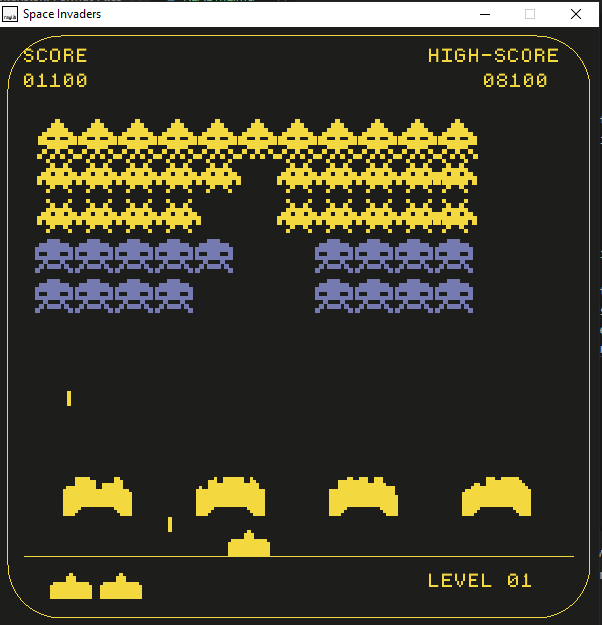

# Space Invaders

Space Invaders is a classic arcade game where players control a spaceship to defend against waves of invading aliens. The objective is to destroy as many aliens as possible while avoiding their projectiles.

## Overview

This implementation of Space Invaders is written in C++ using the Raylib library. The game follows the basic rules of Space Invaders:
- Players control a spaceship that can move horizontally at the bottom of the screen.
- Waves of aliens move horizontally and descend towards the player's spaceship.
- Players must avoid alien projectiles while shooting at and destroying the aliens.
- The game ends when all player lives are lost or when all aliens are destroyed.

## Features

- Classic Space Invaders gameplay: Defend against waves of invading aliens and destroy as many as possible.
- Simple controls: Use arrow keys (Left, Right) to move the spaceship horizontally, and use the Space bar to shoot projectiles.
- Restart functionality: Press the Enter key to restart the game after it ends.
- Immersive audio experience: Includes sound effects for spaceship movement, shooting, alien explosions, and background music for a more engaging gameplay experience.
- High score tracking: The game tracks and displays the player's highest score achieved in previous playthroughs, saving it in a file for persistence across sessions.
- Varied alien types: Utilizes three types of aliens with distinct behaviors and appearances, adding variety and challenge to the gameplay.
## Gameplay

1. Start the game by running the executable.
2. Use the arrow keys to move the spaceship left or right to avoid alien projectiles and shoot them down.
3. Press the Space bar to shoot projectiles at the aliens.
4. Destroy as many aliens as possible without getting hit by their projectiles.
5. The game ends when all player lives are lost or when all aliens are destroyed.
6. Press the Enter key to restart the game after it ends.

## Credits

- Built using [Raylib](https://www.raylib.com/)
- Inspired by the classic Space Invaders game

